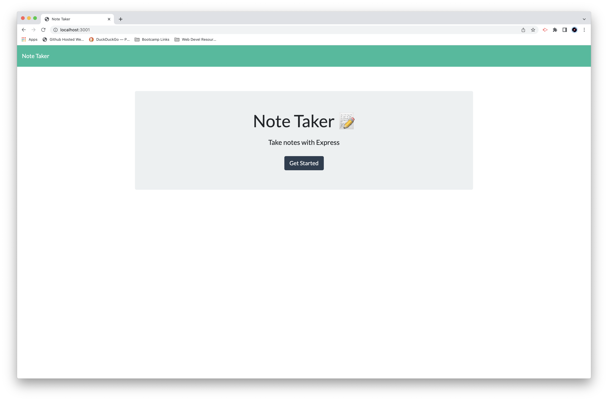
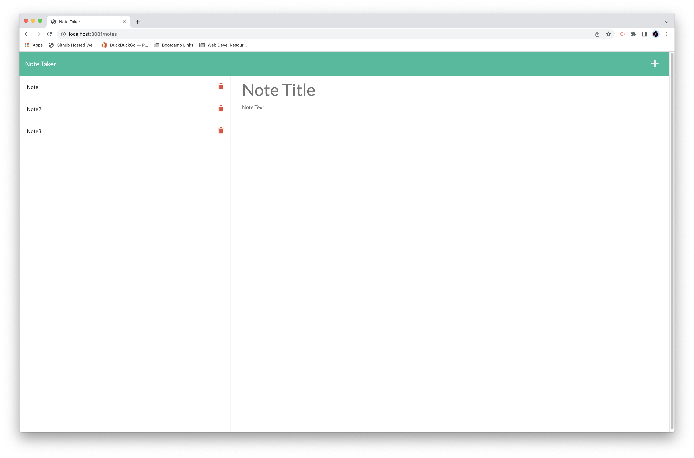

# Note Taker Utility

## Licensing-

Link: [MIT License](https://opensource.org/licenses/MIT)

## Description-

  This application takes notes that are entered and stores them in a flat file in JSON format. It reads the stored 'Notes' when the program is launched so that they are persistent until manually deleted by the application user.
  
## Installation-

  This app uses Node.js, the package.json file has all the dependancies inside. Copying the directory sturcture as-is and going to the root level then running the command 'npm install' will collect the required modules and install them.

## Screenshots-

Initial launch:

Opening the '.../notes' URL:

Clicking on a stored note brings up the Title and strored body text:

## Usage-

  The app is hosted 'live' on Heroku:
  
  To run locally: The app server is launched by Node, type the command 'node server.js' to start the back-end. Then launch a web browser and go to the URL 'localhost:3001/' to get the inital page.

## Contributing-

  [Contributor Covenant](https://www.contributor-covenant.org/)

## Testing

  No testing is provided.

## Additional Info-

- Github: [cliff-rosenberg](https://github.com/cliff-rosenberg)
- Email: cliff459@icloud.com
